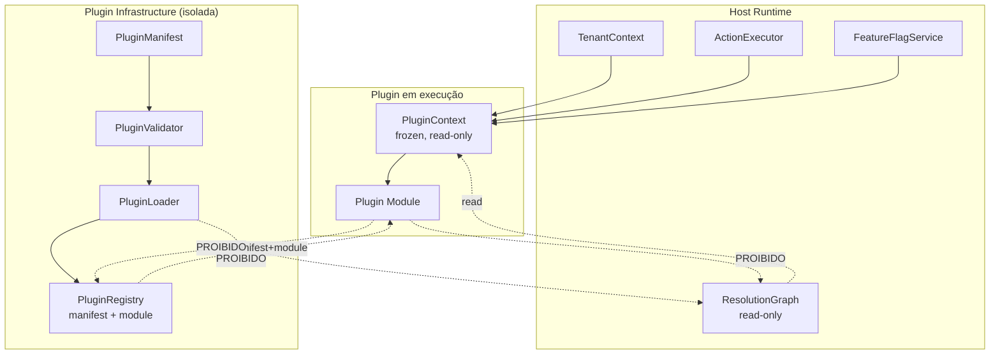

# Plugin Boundaries — Diagrama

**Regras aplicadas:**
- `PluginContext` é read-only (Constituição §3.5, §5 invariante 8).
- `PluginRegistry` isola manifest+module e **não** se confunde com os
  registries do Workspace (Hard Gate G4).
- `PluginLoader` não modifica `ResolutionGraph` (Hard Gate G3).
- `FeatureFlagService` retorna booleanos e não altera resolução (G2).
