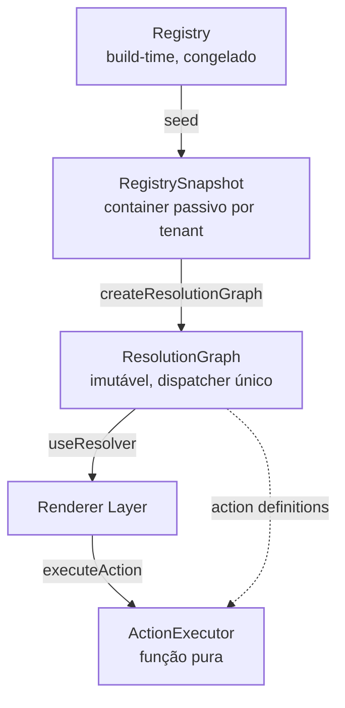

# Registry Layers — Diagrama

**Separação estrita (Constituição §3, §4):**
| Camada | Faz | Não faz |
|---|---|---|
| Registry | Indexa definições build-time | Executar, resolver, conhecer tenant |
| Snapshot | Isola instâncias por tenant | Resolver, executar, decidir |
| ResolutionGraph | Dispatch imutável O(1) | Mutar, executar lógica de negócio |
| Renderer | Renderizar resolvido | Dispatch, lookup direto |
| Executor | Executar action pura | Tocar grafo, mutar snapshot |
