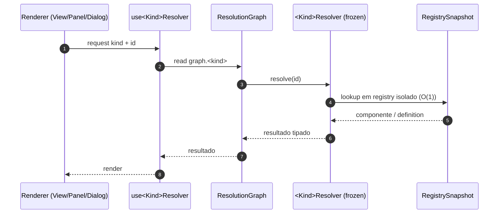
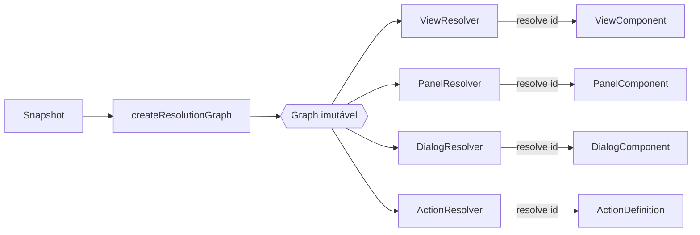

# Resolution Flow — Diagrama

**Invariantes reforçados:** único dispatcher `resolutionGraph.<kind>.resolve(id)`;
lookup O(1); zero mutação; zero string-dispatch genérico
(Constituição §5, invariantes 5–7, 12).
