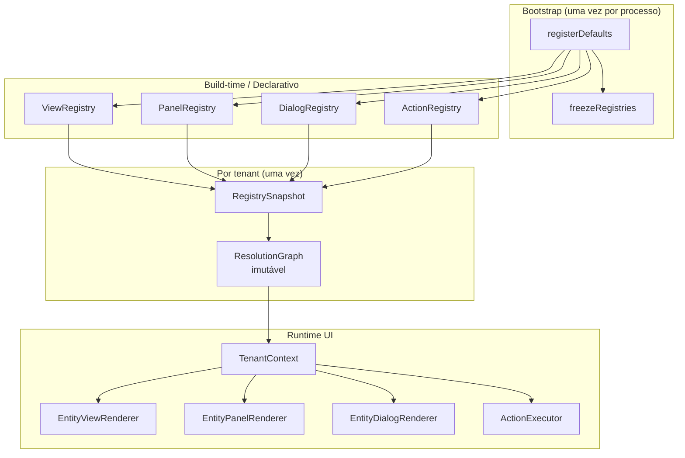

# Workspace Runtime — Diagrama

**Regras aplicadas:** fluxo único, sem atalhos entre camadas
(Constituição §4). `Bootstrap` executa uma única vez; `Snapshot` e
`ResolutionGraph` são construídos uma vez por tenant e congelados.
